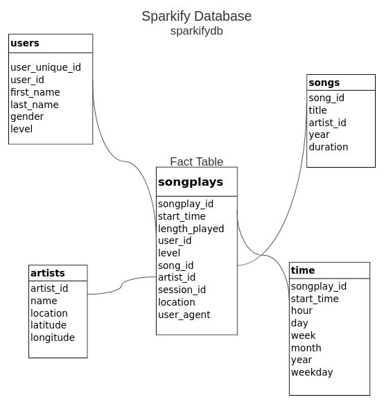

# Data modelling with Postgres for a startup Sparkify
The data includes log-files and metadata on the songs stored in multiple JSON files. 
The ETL pipeline was build using Python. 

## The Entity Relationship Diagram of 


The database (DB) **sparkifydb** and the following tables were created:

## Fact Table
**songplays** - records with page `NextSong` in log data. Note, that time in `start_time` is given in miliseconds. The table contains: 
songplay_id, start_time, length_played, user_id, level, song_id, artist_id, session_id, location, user_agent

## Dimension Tables

**users** - users in the app. The table contains:
user_id, first_name, last_name, gender, level

**songs** - songs in music database. The table contains:
song_id, title, artist_id, year, duration

**artists** - artists in music database. The table contains:
artist_id, name, location, latitude, longitude

**time** - timestamps of records in songplays broken down into specific units. Note, that time in `start_time` is given in miliseconds. Weekdays are encoded `Monday == 0 … Sunday == 6`.
The table contains:
start_time, hour, day, week, month, year, weekday

## How to run python code

- **To create DB and the tables** lounch a terminal window and run
```
python -m create_tables
```

- **To execute ETL** run the following in the terminal
```
python -m etl
```

- **To test the result** run all cells in `test.ipynb` file after the DB and the tables were created in previouse steps.